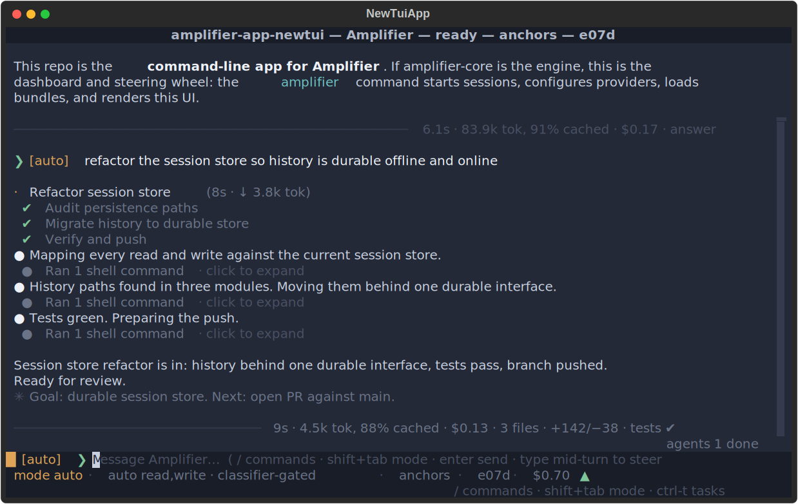
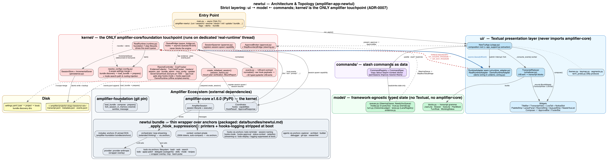
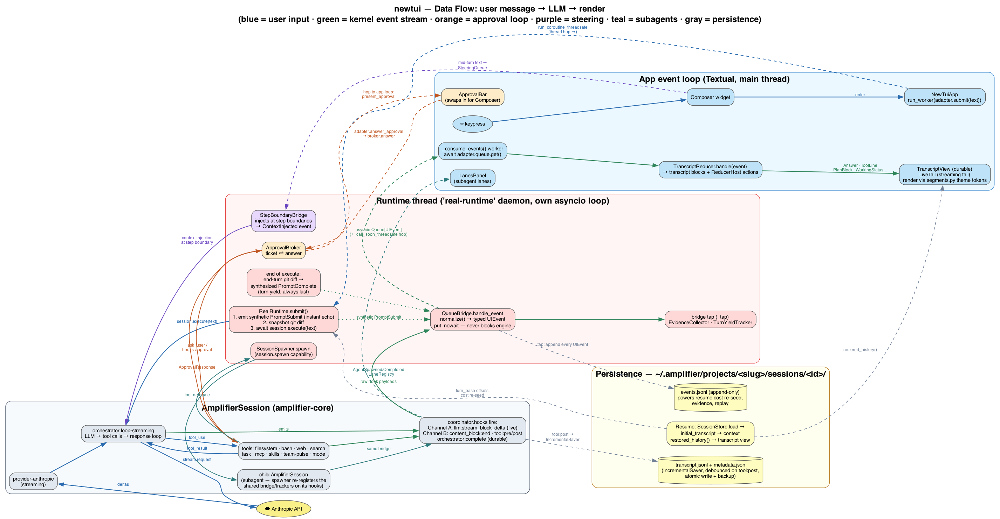
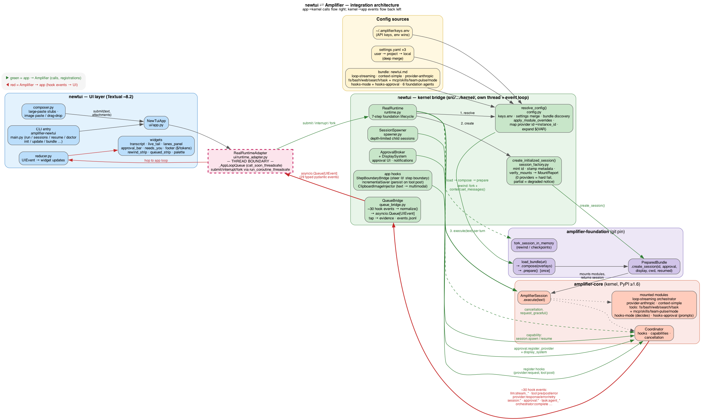

# Amplifier App — New TUI

Ground-up full-screen Textual TUI rebuild of amplifier-app-cli, 100% compliant with docs/DESIGN-SPEC.md (Amplifier TUI v3 — Cohesive).



*The screenshot is the app's own `--demo` session (fully offline). Regenerate it with `uv run python scripts/regen_screenshot.py`.*

## Install

This app is a front-end for [Amplifier](https://github.com/microsoft/amplifier) — install the platform first, then this app. Like Amplifier, it is developed and tested on macOS, Linux, and WSL. You need `git`; `uv` fetches a suitable Python (3.12+) automatically.

### 1. Install uv

```sh
curl -LsSf https://astral.sh/uv/install.sh | sh
```

### 2. Deploy Amplifier

*Already have Amplifier set up? Skip to step 3.*

```sh
uv tool install git+https://github.com/microsoft/amplifier
amplifier init     # first-time wizard: pick a provider, save credentials
```

You'll need an API key for your provider (e.g. [console.anthropic.com](https://console.anthropic.com/settings/keys) — the packaged bundle uses Anthropic by default). If `amplifier` isn't found after install, run `uv tool update-shell` and restart your terminal.

`amplifier init` writes your provider credentials and settings to `~/.amplifier/` (`keys.env`, `settings.yaml`) — **this app reads the same configuration**, so once Amplifier works, the TUI works. It also gives you the `amplifier` CLI itself (bundles, sessions, agents — see the [Amplifier README](https://github.com/microsoft/amplifier)).

Already have `ANTHROPIC_API_KEY` exported in your shell? You can skip `amplifier init` — the app reads your environment directly (env vars win over `keys.env`).

### 3. Install this app

```sh
git clone https://github.com/michaeljabbour/amplifier-app-newtui
cd amplifier-app-newtui
uv sync            # installs everything, incl. pinned amplifier-core / amplifier-foundation
```

### 4. Verify

```sh
uv run amplifier-newtui doctor   # checks install, PATH, settings health; exit 0 = ready
uv run amplifier-newtui --demo   # full UI on a scripted session — free, offline, zero credentials
uv run amplifier-newtui          # the real thing (talks to your provider — API usage costs money)
```

If `doctor` reports findings, it explains each fix. Note that it checks install/PATH/settings health — not credentials; a missing API key surfaces at first real launch (`--demo` never needs one).

## Run

```sh
uv run amplifier-newtui            # launch the full-screen TUI (real session)
uv run amplifier-newtui --demo     # launch with the scripted DemoRuntime (no credentials needed)
```

Options and subcommands:

```sh
uv run amplifier-newtui --bundle NAME_OR_URI   # pick a bundle (default: settings/bundled)
uv run amplifier-newtui doctor                 # setup checkup; exit 1 when findings exist
uv run amplifier-newtui sessions               # list stored session ids for this project
uv run amplifier-newtui resume SESSION_ID      # relaunch the TUI resuming a stored session
uv run amplifier-newtui run "PROMPT"           # execute one prompt headlessly, print the response
```

A *bundle* is a packaged agent configuration — provider + tools + agents + behaviors. The app ships one (`newtui`), so you never need `--bundle` to get started.

### Use it on your own projects

`uv run` works inside this clone; to use the TUI anywhere, install it as a tool:

```sh
uv tool install /path/to/amplifier-app-newtui
cd ~/code/my-project
amplifier-newtui                   # sessions are stored per project directory
```

### Updating / uninstalling

```sh
git pull && uv sync                          # update this app (clone workflow)
uv tool install --reinstall /path/to/clone   # update this app (tool install workflow)
uv tool upgrade amplifier                    # update the Amplifier platform
uv tool uninstall amplifier-app-newtui       # remove this app (tool install)
uv tool uninstall amplifier                  # remove the Amplifier platform
```

## Providers

The packaged bundle ships `provider-anthropic`, but the provider is not hard-wired — settings overlay onto the mount plan, so you can add or reconfigure providers without editing the bundle. In `~/.amplifier/settings.yaml` (user), `.amplifier/settings.yaml` (project), or `.amplifier/settings.local.yaml` (gitignored):

```yaml
config:
  providers:
    # reconfigure the bundled provider (merged by module id)
    - module: provider-anthropic
      config: { default_model: claude-sonnet-4-5 }
    # …or append another provider entirely
    - module: provider-openai
      source: git+https://github.com/microsoft/amplifier-module-provider-openai@main
      config: { api_key: "${OPENAI_API_KEY}", priority: 10 }
```

Entries merge by module id (bundled config wins on nothing, your overlay fills the rest); a new module id is appended. `${VAR}` / `${VAR:default}` placeholders expand from the environment. For a fully different stack, point `--bundle` at your own bundle file or URI. The complete settings reference (every key, merge order, env vars) is in [docs/SETTINGS.md](docs/SETTINGS.md).

## Copying text

Drag with the mouse to select transcript text (the app highlights it), then press **ctrl+c** — the selection is copied through your OS clipboard tool (pbcopy / wl-copy / xclip) *and* OSC 52, and a `copied · N chars` notice confirms it. Terminal caveats:

- **Over SSH** OSC 52 is the only path — on iTerm2 enable *Settings → General → Selection → "Applications in terminal may access clipboard"* or remote copies land nowhere.
- **⌘C** reaches the app (and copies) on kitty-protocol terminals; elsewhere use ctrl+c inside the TUI, or hold **⌥ Option while dragging** (iTerm2) / **Shift while dragging** (most Linux terminals) to bypass the app and use your terminal's native selection + ⌘C.

## Keybindings note

The app requests progressive keyboard enhancement (kitty keyboard protocol + xterm modifyOtherKeys), so **shift+enter** queues a full next-turn message natively on kitty, WezTerm, foot, Ghostty, and recent iTerm2/Windows Terminal. On legacy terminals **alt+enter** is the fallback; it works everywhere (the composer hint adapts automatically). Full key reference: [docs/USER-GUIDE.md §8](docs/USER-GUIDE.md#8-keys).

## Layout

```
src/amplifier_app_newtui/   the installable app (kernel / model / ui / commands)
tests/                      offline test suite (no credentials required)
docs/                       user guide, architecture, design spec, ADRs (docs/notes/ is local scratch, gitignored)
scripts/                    maintenance utilities (README screenshot regen)
bundle.md                   the repo's amplifier bundle (packaged copy kept byte-identical)
```

## Documentation

| Read | For |
|---|---|
| [docs/USER-GUIDE.md](docs/USER-GUIDE.md) | driving the TUI: modes, steering, approvals, lanes, rewind, keys, commands |
| [docs/SETTINGS.md](docs/SETTINGS.md) | configuration reference: every key, file locations, merge order, env vars |
| [docs/ARCHITECTURE.md](docs/ARCHITECTURE.md) | how it's built, module by module |
| [docs/DEVELOPMENT.md](docs/DEVELOPMENT.md) | working on the code: tests, goldens, layering rules, PR checklist |
| [docs/DESIGN-SPEC.md](docs/DESIGN-SPEC.md) | the behavioral spec the app is built to (authoritative) |
| [docs/BACKLOG.md](docs/BACKLOG.md) | what's next, calibrated against what's already shipped |
| [docs/design-v3-cohesive.html](docs/design-v3-cohesive.html) | executable mockup — exact strings, colors, timing, state machines |
| [docs/decisions/](docs/decisions/) | ADRs — why it's shaped this way (ADR-0007 = the architecture rules) |

## Architecture

Four strictly-layered packages ([ADR-0007](docs/decisions/ADR-0007-newtui-ground-up-architecture.md)): `ui/` and `commands/` depend on `model/`; `kernel/` is the **only** package that touches amplifier-core/foundation and never imports Textual; the UI sees the kernel exclusively through normalized `UIEvent`s. The full walk-through — boot, event pipeline, governance, subagents, persistence — is in [docs/ARCHITECTURE.md](docs/ARCHITECTURE.md).







## Development

```sh
uv sync                # install dependencies
uv run pytest -q       # full test suite (offline)
uv run ruff check .    # lint
uv run pyright src/    # types
```

See [docs/DEVELOPMENT.md](docs/DEVELOPMENT.md) for the full workflow: running single tests, regenerating goldens, diagrams and the README screenshot, the layering rules, and the PR checklist.
