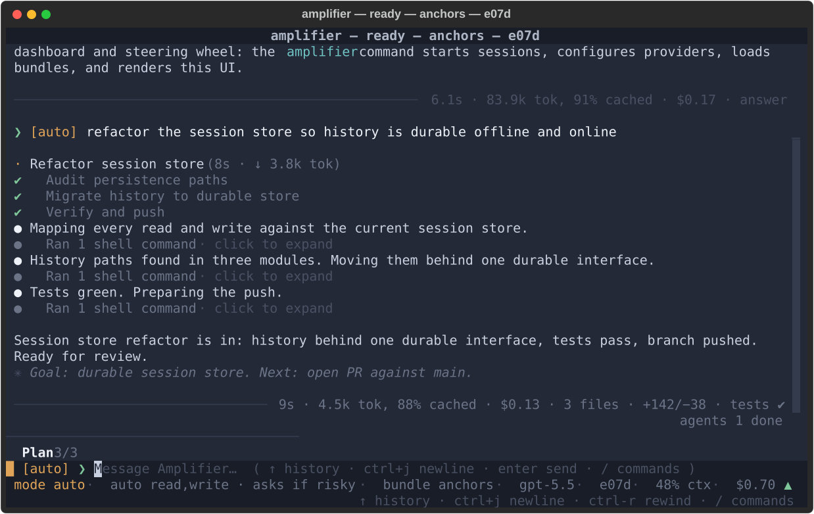
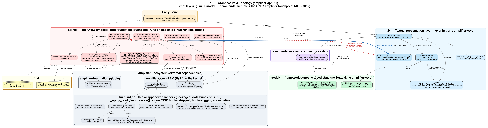
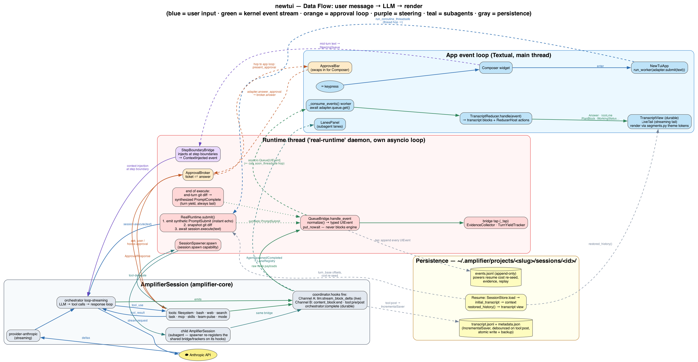
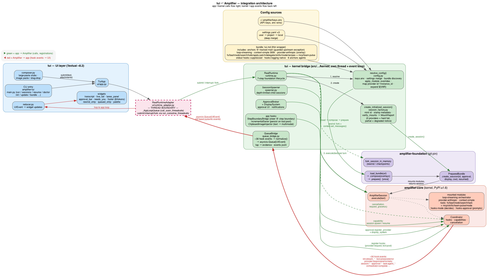

# Amplifier TUI

A full-screen terminal UI for [Amplifier](https://github.com/microsoft/amplifier) — modes, steering, live subagent lanes, rewind, and cost tracking — built directly on amplifier-core and amplifier-foundation.



*The screenshot is the app's own `--demo` session (fully offline). Regenerate it with `uv run python scripts/regen_screenshot.py`.*

## Install

```sh
curl -LsSf https://astral.sh/uv/install.sh | sh                            # 1. get uv (skip if you have it)
uv tool install git+https://github.com/michaeljabbour/amplifier-app-tui   # 2. install the app
amplifier-tui init                                                         # 3. pick a provider, save an API key
amplifier-tui                                                              # 4. go
```

That's it. `uv` fetches a suitable Python (3.12+) automatically, and the install pins the tested `amplifier-core` / `amplifier-foundation` versions. Developed and tested on macOS, Linux, and WSL; you need `git`.

- **No API key yet?** `amplifier-tui --demo` runs the full UI on a scripted session — free, offline, zero credentials. When you're ready, keys come from your provider (e.g. [console.anthropic.com](https://console.anthropic.com/settings/keys) — the packaged bundle uses Anthropic by default).
- **Already have `ANTHROPIC_API_KEY` exported?** Skip `init` — the app reads your environment directly (env vars win over saved keys).
- **`amplifier-tui: command not found`?** Run `uv tool update-shell` and restart your terminal.
- **Something off?** `amplifier-tui doctor` checks install, PATH, and settings health (exit 0 = ready) and explains each fix. It doesn't check credentials; a missing key surfaces at first real launch (`--demo` never needs one).

Credentials and settings live in `~/.amplifier/` (`keys.env`, `settings.yaml`) — the same configuration the full [Amplifier](https://github.com/microsoft/amplifier) platform uses, in both directions: if you already run Amplifier, the TUI picks up your setup with zero extra configuration.

### Optional: the full Amplifier platform

The TUI bundles everything it needs, but the `amplifier` CLI itself (bundles, sessions, agents — see the [Amplifier README](https://github.com/microsoft/amplifier)) is one command away and shares the same `~/.amplifier/` configuration:

```sh
uv tool install git+https://github.com/microsoft/amplifier
amplifier init
```

The two commands coexist on purpose: this app installs `amplifier-tui`, the platform installs
`amplifier`. That is a settled decision, not a placeholder —
[ADR-0008](docs/decisions/ADR-0008-console-script-name.md) records why (a second package
claiming `amplifier` breaks both installs and self-update) and what the only viable path to a
plain `amplifier` TUI would be.

### From a clone (development)

```sh
git clone https://github.com/michaeljabbour/amplifier-app-tui
cd amplifier-app-tui
uv sync                       # installs everything, incl. pinned amplifier-core / amplifier-foundation
uv run amplifier-tui doctor   # verify: install, PATH, settings health; exit 0 = ready
uv run amplifier-tui --demo   # try it offline
```

`uv run` works inside the clone, but for daily use prefer the tool install — it gives the app a durable environment, so bundle modules install **once and persist** instead of re-deriving on a volatile project venv at every launch (`uv tool install /path/to/amplifier-app-tui` works on a local clone too).

## Run

```sh
amplifier-tui            # launch the full-screen TUI (real session — talks to your provider)
amplifier-tui --demo     # launch with the scripted DemoRuntime (no credentials needed)
```

Sessions are stored per project directory — `cd` into your project and launch. (Inside a clone without a tool install, prefix commands with `uv run`.)

Options and subcommands:

```sh
amplifier-tui --bundle NAME_OR_URI   # pick a bundle (default: settings/bundled)
amplifier-tui doctor                 # setup checkup; exit 1 when findings exist
amplifier-tui init                   # set up a provider key in ~/.amplifier/keys.env
amplifier-tui sessions               # list stored session ids for this project
amplifier-tui resume SESSION_ID      # relaunch the TUI resuming a stored session
amplifier-tui run "PROMPT"           # execute one prompt headlessly, print the response
printf 'PROMPT\n' | amplifier-tui run # stdin one-shot
amplifier-tui run --output-format json "PROMPT"       # JSON-only stdout
amplifier-tui run --output-format json-trace "PROMPT" # JSON + normalized event trace
amplifier-tui run --output-format jsonl "PROMPT"      # live versioned event stream
amplifier-tui allowed-dirs add ../shared --project     # persistent write capability
amplifier-tui denied-dirs add .git --project           # persistent write block
amplifier-tui bundle list            # bundles from the shared registry (--all incl. deps)
amplifier-tui bundle use NAME        # set the active bundle (--global/--project/--local)
amplifier-tui update --check-only    # check the mounted bundles/modules for updates
```

A *bundle* is a packaged agent configuration — provider + tools + agents + behaviors. The app ships one (`tui`), so you never need `--bundle` to get started. The `bundle` group (`list · show · use · clear · current · add · remove · update`) reads and writes the same registry and settings the reference `amplifier` CLI uses.

JSON modes reserve stdout for machine-readable output; module diagnostics go to stderr.
`json` and `json-trace` emit one document, while `jsonl` flushes `session.started`,
normalized `runtime.event`, and one terminal `turn.completed` or `error` record live.
That JSONL stream is the SDK contract: the dependency-free
[Python](sdk/python/README.md) and zero-runtime-dependency
[TypeScript](sdk/typescript/README.md) clients are thin subprocess wrappers, so they cannot
drift into a second implementation of Amplifier behavior.

Inside the TUI, `/` opens the command palette: mode/plan/rewind/ledger, live-session
commands, `/allowed-dirs` and `/denied-dirs` for session-scoped path capabilities, and
`/skills · /skill <name> · /mcp` (see [User Guide §7](docs/USER-GUIDE.md#7-commands)).
Use ↑/↓ for prompt history, and ctrl+j or ctrl+enter for a newline. Type `@` after
whitespace to autocomplete a workspace file into the composer. The mounted filesystem
tool hard-enforces write paths; the kernel keeps approval and execution path policy as
separate decisions, with `.git`, `.agents`, `.codex`, and `AGENTS.md` protected by default.
Bundle-native modes such as `careful` can add confirmation policy without weakening that
path boundary.

### Faster boots (composing fewer bundles)

Every `bundle.app` overlay composes on **every** session and runs its boot hooks, so
a large overlay list slows startup. Two levers:

```yaml
# ~/.amplifier/settings.yaml — hold heavy overlays back from boot (opt-in)
bundle:
  deferred:
    - git+https://github.com/microsoft/amplifier-bundle-digital-twin-universe@main
    # …any bundle.app entry you don't need on every session
```

Deferred bundles are **not** composed at boot (faster startup); load one into the
running session on demand, or pre-install a bundle's modules once so a later boot only
ever skips:

```sh
# in-session
/bundle                 # list deferred overlays
/bundle load NAME       # compose a deferred bundle into the live session

# out-of-session
amplifier-tui bundle warm NAME     # install a bundle's modules ahead of time
```

With no `bundle.deferred` set, boot composes exactly what it did before — deferral is
opt-in and backward-compatible. (In-session load mounts additive tools/hooks/agents;
single-slot modules — providers, orchestrator, context — attach at the next boot.)

### Updating / uninstalling

```sh
uv tool install --reinstall git+https://github.com/michaeljabbour/amplifier-app-tui  # update this app
amplifier-tui update                         # update the mounted bundles/modules (SHA-compare + re-fetch)
uv tool upgrade amplifier                    # update the Amplifier platform (if installed)
uv tool uninstall amplifier-app-tui          # remove this app
uv tool uninstall amplifier                  # remove the Amplifier platform
git pull && uv sync                          # update a development clone instead
```

`amplifier-tui update --check-only` reports available bundle/module updates without
changing anything; `--force` runs `uv cache clean` first so `@main` sources genuinely re-fetch.

## Providers

The packaged bundle ships `provider-anthropic`, but the provider is not hard-wired — settings overlay onto the mount plan, so you can add or reconfigure providers without editing the bundle. In `~/.amplifier/settings.yaml` (user), `.amplifier/settings.yaml` (project), or `.amplifier/settings.local.yaml` (gitignored):

```yaml
config:
  providers:
    # reconfigure the bundled provider (merged by module id)
    - module: provider-anthropic
      config: { default_model: claude-sonnet-4-5 }
    # …or append another provider entirely
    - module: provider-openai
      source: git+https://github.com/microsoft/amplifier-module-provider-openai@main
      config: { api_key: "${OPENAI_API_KEY}", priority: 10 }
```

Entries merge by module id (bundled config wins on nothing, your overlay fills the rest); a new module id is appended. `${VAR}` / `${VAR:default}` placeholders expand from the environment. For a fully different stack, point `--bundle` at your own bundle file or URI. The complete settings reference (every key, merge order, env vars) is in [docs/SETTINGS.md](docs/SETTINGS.md).

## Copying text

Drag with the mouse to select transcript text (the app highlights it), then press **ctrl+c** — the selection is copied through your OS clipboard tool (pbcopy / wl-copy / xclip) *and* OSC 52, and a `copied · N chars` notice confirms it. Terminal caveats:

- **Over SSH** OSC 52 is the only path — on iTerm2 enable *Settings → General → Selection → "Applications in terminal may access clipboard"* or remote copies land nowhere.
- **⌘C** reaches the app (and copies) on kitty-protocol terminals; elsewhere use ctrl+c inside the TUI, or hold **⌥ Option while dragging** (iTerm2) / **Shift while dragging** (most Linux terminals) to bypass the app and use your terminal's native selection + ⌘C.

## Keybindings note

The app requests progressive keyboard enhancement (kitty keyboard protocol + xterm modifyOtherKeys), so **shift+enter** queues a full next-turn message natively on kitty, WezTerm, foot, Ghostty, and recent iTerm2/Windows Terminal. On legacy terminals **alt+enter** is the fallback; it works everywhere (the composer hint adapts automatically). Full key reference: [docs/USER-GUIDE.md §8](docs/USER-GUIDE.md#8-keys).

## Layout

```
src/amplifier_app_tui/   the installable app (kernel / model / ui / commands)
tests/                      offline test suite (no credentials required)
docs/                       user guide, architecture, design spec, ADRs (docs/notes/ is local scratch, gitignored)
scripts/                    maintenance utilities (README screenshot regen)
sdk/python/                 thin typed Python client over CLI JSONL
sdk/typescript/             thin typed TypeScript client over CLI JSONL
bundle.md                   the repo's amplifier bundle (packaged copy kept byte-identical)
```

## Documentation

| Read | For |
|---|---|
| [docs/USER-GUIDE.md](docs/USER-GUIDE.md) | driving the TUI: modes, steering, approvals, lanes, rewind, keys, commands |
| [docs/SETTINGS.md](docs/SETTINGS.md) | configuration reference: every key, file locations, merge order, env vars |
| [docs/ARCHITECTURE.md](docs/ARCHITECTURE.md) | how it's built, module by module |
| [docs/DEVELOPMENT.md](docs/DEVELOPMENT.md) | working on the code: tests, goldens, layering rules, PR checklist |
| [docs/DESIGN-SPEC.md](docs/DESIGN-SPEC.md) | the behavioral spec the app is built to (authoritative) |
| [docs/BACKLOG.md](docs/BACKLOG.md) | what's next, calibrated against what's already shipped |
| [docs/design-v3-cohesive.html](docs/design-v3-cohesive.html) | executable mockup — exact strings, colors, timing, state machines |
| [docs/decisions/](docs/decisions/) | ADRs — why it's shaped this way (ADR-0007 = the architecture rules; ADR-0008 = the `amplifier-tui` command name) |
| [docs/plans/](docs/plans/) | dated implementation plans, each with a status banner (all landed to date) |

## Architecture

Four strictly-layered packages ([ADR-0007](docs/decisions/ADR-0007-tui-ground-up-architecture.md)): `ui/` and `commands/` depend on `model/`; `kernel/` is the **only** package that touches amplifier-core/foundation and never imports Textual; the UI sees the kernel exclusively through normalized `UIEvent`s. The full walk-through — boot, event pipeline, governance, subagents, persistence — is in [docs/ARCHITECTURE.md](docs/ARCHITECTURE.md).







## Development

```sh
uv sync                # install dependencies
uv run pytest -q       # full test suite (offline)
uv run ruff check .    # lint
uv run pyright src/    # types
```

See [docs/DEVELOPMENT.md](docs/DEVELOPMENT.md) for the full workflow: running single tests, regenerating goldens, diagrams and the README screenshot, the layering rules, and the PR checklist.
